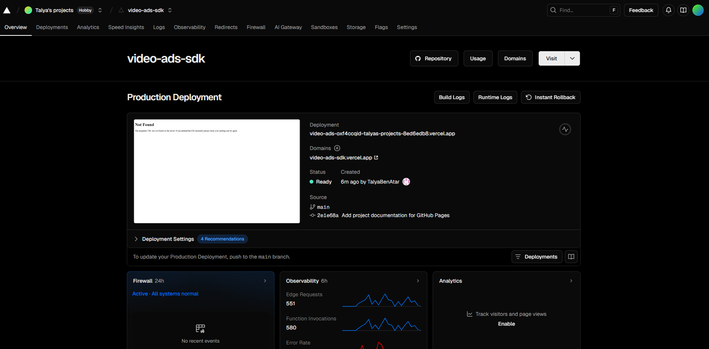
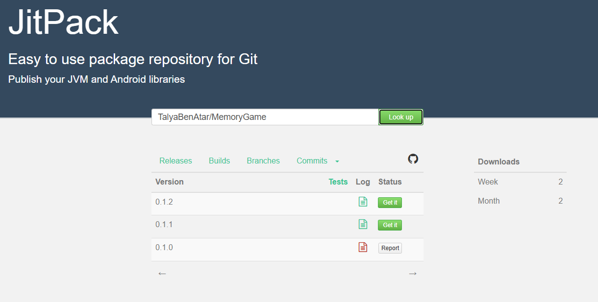

[Home](index.md) | [SDK](sdk.md) | [API](api.md) | [Portal](portal.md)

---


\# 📱 Android Ads SDK


The \*\*Ads SDK\*\* is a reusable Android library that allows applications to display image and video ads in a \*\*full-screen, SDK-controlled experience\*\*.


The SDK fully encapsulates ad fetching, selection, UI rendering, countdown logic, and lifecycle handling.  

Host applications interact with the SDK through a minimal and safe public API.


---


\## ✨ Key Features


\### 🎬 Video Ads

\- Auto-play on launch

\- No pause or seek controls

\- Automatically closes when playback ends


\### 🖼️ Image Ads

\- Displayed full-screen

\- Automatically closes after a fixed timeout


\### ⏳ Ad Control \& UX

\- Countdown-based close button

\- SDK-managed UI (no layouts needed in the host app)

\- No lifecycle handling required by the host application


---


\## ⚙️ Requirements


\- Android API level \*\*24+\*\*

\- Host activity must extend `ComponentActivity` or `AppCompatActivity`

\- Internet permission enabled in the host application

\- Backend API compatible with the SDK schema


---


\## 📦 Installation


The SDK is distributed via \*\*JitPack\*\*.


\### 1️⃣ Add JitPack to your project


In `settings.gradle.kts`:


```kotlin

dependencyResolutionManagement {

&nbsp;   repositories {

&nbsp;       google()

&nbsp;       mavenCentral()

&nbsp;       maven { url = uri("https://jitpack.io") }

&nbsp;   }

}

```

&nbsp;

\###  2️⃣ Add the SDK dependency

```

dependencies {

&nbsp;   implementation("com.github.TalyaBenAtar:MemoryGame:0.1.2")

}

```

---

\## 🚀 Usage

🔑 Initialization


Initialize the SDK once at application startup

(recommended inside Application.onCreate()):

```

AdsSdk.init("https://video-ads-sdk.vercel.app")

```

▶️ Showing an Ad


Show an ad filtered by category:

```

AdsSdk.showAd(this, category = "kids")

```


Optionally, prefer a specific ad type:

```

AdsSdk.showAd(

&nbsp;   activity = this,

&nbsp;   category = "kids",

&nbsp;   preferredType = "image" // or "video"

)

```


When showAd is called, the SDK will:


Fetch ads from the backend

Select a valid, enabled ad matching the filters

Launch its own full-screen ad Activity

Handle playback, countdown, and closing behavior

---


\## 🧠 How It Works

When showAd is called, the SDK will:

* Fetch eligible ads from the backend API


* Apply client configuration rules


* Select a valid enabled ad


* Launch a full-screen SDK-owned activity


* Handle playback, countdown, and closing behavior

The host application never interacts with ad UI or backend logic directly.


\## 🧪 Demo Application

A demo application (Memory Game) is included in the SDK repository.


It demonstrates:

* SDK initialization


* Triggering ads from real app flows


* Displaying both image and video ads

This app can be used during development to validate SDK behavior.


---

## 📸 SDK Screenshots

### 🎬 Video Ad Display


---

### 🖼️ Image Ad Display


---

### 🔧 Deployment / Distribution (Optional)





